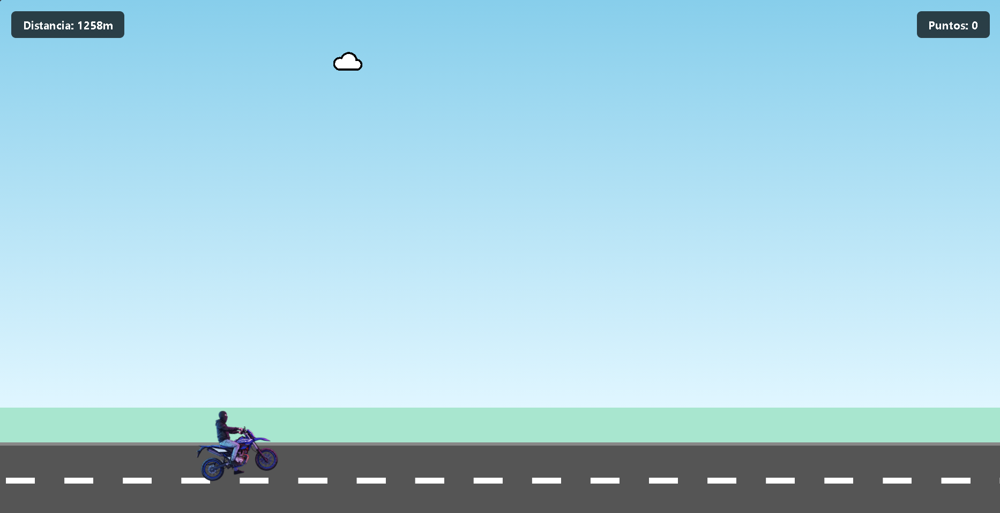
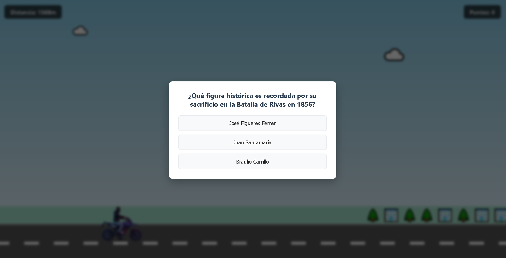

# Proyecto Personal - Multimedios: Wheelies Con conocimiento

Juego tipo "Endless Runner" interactivo desarrollado con **Vue 3** y **Vite**, centrado en una trivia temática sobre Costa Rica.

## Funcionalidades principales
* **Mecánica de juego**: Control de moto con físicas simples y detección de colisiones.
* **Trivia dinámica**: Preguntas cargadas desde un archivo JSON con orden aleatorio.
* **Diseño Responsivo**: Adaptado tanto para escritorio (teclado) como para dispositivos móviles (controles táctiles).
* **Persistencia**: Registro de puntuaciones mediante `localStorage`.

## Instrucciones de ejecución
Para ejecutar el proyecto en tu entorno local:

1. Clonar el repositorio.
2. Instalar dependencias:
   ```bash
   npm install

   ## Capturas de pantalla

**Pantalla de juego:**


**Modal de trivia:**
